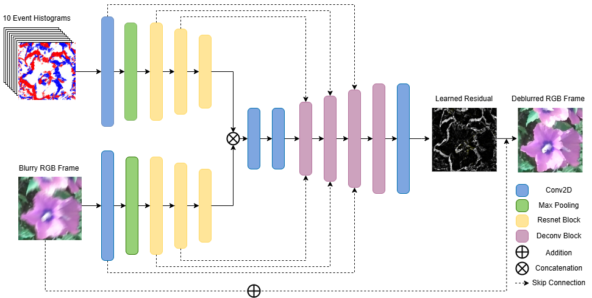
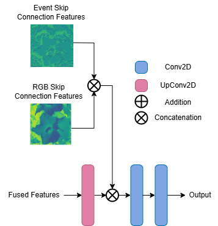
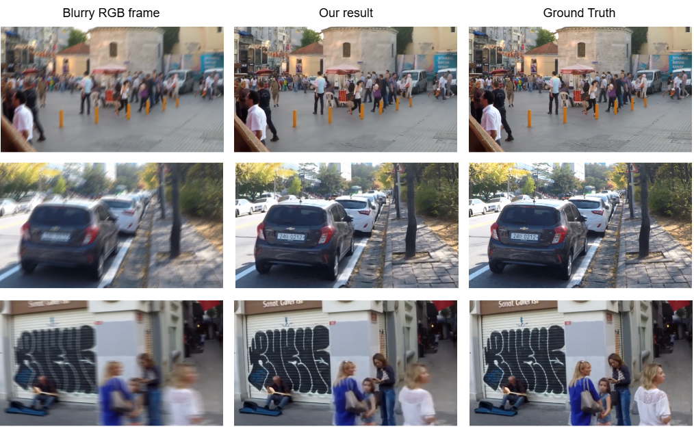

# Leveraging pre-trained features for cross-modal motion deblurring
Motion blur, a common degradation in images captured under dynamic or low-light conditions, poses significant challenges 
for computer vision tasks. We propose a cross-modal deep learning framework for motion deblurring that leverages 
event camera information. Our approach utilizes a dual-stream U-Net style encoder-decoder architecture, for which we use 
two ResNet-34 encoders — one for RGB images pre-trained on the classic ImageNet dataset and the other for event data 
pre-trained on the N-ImageNet dataset.

<figure id='model_architecture'>
    
    <figcaption>Figure 1: Proposed model architecture: Dual Stream U-Net style encoder-decoder, where the encoder for the event data is a N-ImageNet pre-trained ResNet34, and the encoder for the RGB frames is a ImageNet pre-trained ResNet34. The 2 streams are then concatenated and passed through a feature fusion layer composed of 2 convolutions, followed by 4 deconvolution blocks, which make up the decoder. The resulting feature map is then converted to an RGB image via one more convolution. The resulting residual image is added element-wise with the initial blurry image to form the final output.    </figcaption>
</figure>

<br><br>

<figure id='deconv_block_architecture' style="display: block; margin: 0 auto !important; width: 80%;">
    
    <figcaption>Figure 2: Deconvolution block: The fused features from the previous layers are passed through an up-convolution layer and then concatenated with the features maps from the skip-connections. The result is then passed through 2 simple convolutions, to obtain the up-sampled output.</figcaption>
</figure>

<br><br>

<figure id='visual_results'>
    
    <figcaption>Figure 3: Visual results of Our model on the GoPro dataset with synthetic events generated with ESIM.</figcaption>
</figure>

## Installation
1. Clone the repository

```sh
git clone https://github.com/petrapostelnicu/leveraging_pretrained_features_for_cross_modal_motion_deblurring.git & cd leveraging_pretrained_features_for_cross_modal_motion_deblurring
```

2. Install the required libraries (make sure you have Python and pip already installed)

**Optional**: If you have CUDA, first check its version by running 
```sh
nvcc --version
```
and then go to https://pytorch.org/get-started/locally/ and run the command suggested there to ensure the torch versions maches the CUDA version.
Then proceed with installing the rest of the dependencies:

```sh
pip install -r requirements.txt
```

3. Create ```data```, ```logs``` and ```pretrained_models``` folders inside the root of the project.
The structure should look like so:

```
...
├── motion_deblurring_with_event_cameras/
    ├──data/
      └── GOPRO_rawevents/
    ├── datasets/
    ├── loggers/
    ├── logs/
    ├── losses/
    ├── models/
    ├── pretrained_models/
    ├── scripts/
    └── main.py
```

-------------------

## Preparing the Dataset
1. Download the GoPro dataset with synthetically generated events with ESIM from [here](https://data.vision.ee.ethz.ch/csakarid/shared/EFNet/GOPRO_rawevents.zip).
2. Unzip the folder in the ```data``` directory:
```
...
├── motion_deblurring_with_event_cameras/
    ├──data/
      └── GOPRO_rawevents/
     ...
```
3. Because this dataset is contained in H5 files, we cannot directly use a DataLoader on it as it would be very slow. To convert the dataset into a format that can be used when training and testing the model, run:
```sh
python main.py convert_data
```
This will create a subfolder called ```GOPRO_converted``` in the ```data``` directory that contains the new dataset.
4. For more efficient data storage and loading, we also convert the event data from .txt to png:
```sh
python main.py convert_events
```

## Data Visualization 
```sh
python main.py visualize_data --num_samples 10
```

## Training a model
First download the N-ImageNet pretrained feature extractor for the events data from [here](https://drive.google.com/drive/folders/1kmtgjX9hC2kRgUjoBklKt53ftkdQOZk-) (the Event Histogram representation) and put the ```best.tar``` file in a ```pretrained_models``` folder in the root of the project.
```sh
python main.py train_model --config 'configs/config.ini'
```

## Testing a model
```sh
python main.py evaluate_model --model_path 'pretrained_models/our_model.pth' --output_dir 'outputs'
```